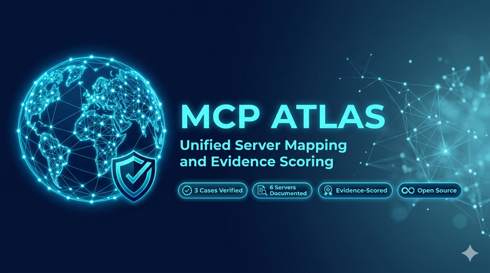

# MCP Atlas

<div align="center">



[](https://mcp-atls.vercel.app)
[](https://opensource.org/licenses/MIT)
[](#case-studies)
[](#server-registry)
[](https://github.com/SamoTech/mcp-atlas)
[](CONTRIBUTING.md)
[](https://github.com/sponsors/SamoTech)

**The definitive registry of real-world enterprise MCP deployments.**

Verified case studies · Server registries · Architecture patterns · Governance models

🌐 **[mcp-atls.vercel.app](https://mcp-atls.vercel.app)** — Live searchable web platform

[Explore Cases](#case-studies) · [Architecture Patterns](#architecture-patterns) · [Server Registry](#server-registry) · [Reports](#reports) · [Contribute](CONTRIBUTING.md)

</div>

---

## What is MCP Atlas?

Model Context Protocol (MCP) is the emerging standard for connecting AI agents to external tools, data, and systems. But most content about MCP is vendor tutorials, speculative demos, or abstract architecture diagrams.

**MCP Atlas is different.** It exists to answer four questions enterprises actually ask:

1. **Who is using MCP in production?** — Real named deployments, not "company X" anonymizations
2. **Which systems are connected?** — Actual tool and data source inventory per deployment
3. **What governance controls exist?** — Access policies, approval gates, risk tiers
4. **Which architecture pattern worked?** — Not what should work — what *did* work

Every entry has an **Enterprise Readiness Score** (1–5) based on proof depth, named systems, governance evidence, and workflow clarity.

---

## Evidence Engine

MCP Atlas now tracks not just who uses MCP, but **how trustworthy each claim is.**

### New in v0.2.0
- ✅ GitHub Actions CI — validates every push and pull request automatically
- ✅ Structured issue templates for new case studies and corrections
- ✅ Server registry profiles for six high-value enterprise MCP servers
- ✅ Governance docs: access models and evidence policy
- ✅ Machine-readable `data/index.json` for future frontend and API work
- ✅ First report: [Enterprise MCP Adoption Report — Q1 2026](reports/2026-q1-enterprise-mcp-adoption.md)

### New in v0.3.0
- ✅ Live Next.js web platform — [mcp-atls.vercel.app](https://mcp-atls.vercel.app)
- ✅ Searchable case studies with evidence score filtering
- ✅ Server registry, architecture patterns, and reports pages
- ✅ Full dark-mode UI with score badges and tag filters

---

## Case Studies

| Company | Industry | MCP Use Case | Systems Connected | Readiness Score | Profile |
|---------|----------|--------------|-------------------|:---------------:|---------|
| Block | Fintech | Dev + cross-functional productivity | GitHub, Jira, Slack, Snowflake, Google Drive | ⭐⭐⭐⭐⭐ | [View →](data/cases/block.md) |
| Gong | Revenue Intelligence | Cross-system AI agent unification | Salesforce, HubSpot, Microsoft Copilot | ⭐⭐⭐⭐ | [View →](data/cases/gong.md) |
| Mindbreeze | Enterprise Search | Incident investigation assistant | Ticketing, internal docs, telemetry | ⭐⭐⭐ | [View →](data/cases/mindbreeze.md) |

> **Transparency note:** Cases are scored by evidence quality, not company size or marketing. "Architecturally vague" claims receive a score of 1 regardless of vendor reputation.

---

## Architecture Patterns

Six battle-tested patterns extracted from real deployments:

| Pattern | Description | Best For | Reference |
|---------|-------------|----------|-----------|
| Hub-and-Spoke | Central MCP Gateway routes to N servers | Large orgs with centralized IT | [View →](docs/patterns/hub-and-spoke.md) |
| Federated Registry | Teams own their MCP servers; central discovery only | Platform-engineering orgs | [View →](docs/patterns/federated-registry.md) |
| Risk-Tiered Access | Tools classified by risk; different approval chains | Regulated industries | [View →](docs/patterns/risk-tiered-access.md) |
| Bidirectional Bridge | Agent reads AND writes across platforms | Revenue and CRM workflows | [View →](docs/patterns/bidirectional-bridge.md) |
| Internal API Proxy | MCP wraps proprietary internal APIs | Enterprises avoiding direct LLM data access | [View →](docs/patterns/internal-api-proxy.md) |
| Sandboxed Developer | Per-developer MCP bundles, org-managed | Dev productivity programs | [View →](docs/patterns/sandboxed-developer.md) |

---

## Server Registry

MCP servers documented with enterprise context:

| Server | Category | Used By | Auth | Profile |
|--------|----------|---------|------|---------|
| GitHub MCP | Developer Tools | Block | OAuth | [View →](data/servers/github-mcp.md) |
| Snowflake MCP | Data Warehouse | Block | Service Account | [View →](data/servers/snowflake-mcp.md) |
| Jira MCP | Project Management | Block | API Token | [View →](data/servers/jira-mcp.md) |
| Slack MCP | Messaging | Block | Bot Token | [View →](data/servers/slack-mcp.md) |
| Salesforce MCP | CRM | Gong | OAuth | [View →](data/servers/salesforce-mcp.md) |
| Google Drive MCP | Document Storage | Block | OAuth | [View →](data/servers/google-drive-mcp.md) |

---

## Reports

| Report | Date | Link |
|--------|------|------|
| Enterprise MCP Adoption — Q1 2026 | March 2026 | [Read →](reports/2026-q1-enterprise-mcp-adoption.md) |

---

## Enterprise Readiness Score Rubric

| Score | Meaning |
|-------|---------|
| ⭐ | Claim made, zero technical evidence |
| ⭐⭐ | Architecturally described, no named systems |
| ⭐⭐⭐ | Named systems + workflow described |
| ⭐⭐⭐⭐ | Named systems + governance controls documented |
| ⭐⭐⭐⭐⭐ | All above + measured user/business outcomes |

---

## Governance

- [Access Models](docs/governance/access-models.md) — Read-only, write-confirm, admin-gated
- [Evidence Policy](docs/governance/evidence-policy.md) — Scoring rules, inference rules, correction policy

---

## Project Structure

```
mcp-atlas/
├── data/
│   ├── cases/          # Enterprise case study files
│   ├── servers/        # MCP server profiles
│   ├── schema/         # Templates for data entry
│   └── index.json      # Machine-readable catalog
├── docs/
│   ├── patterns/       # Architecture pattern deep-dives
│   ├── governance/     # Evidence policy and access models
│   ├── ARCHITECTURE.md
│   └── assets/
├── reports/            # Enterprise MCP adoption reports
├── scripts/            # Validation scripts
├── web/                # Next.js web platform (deployed to Vercel)
├── CONTRIBUTING.md
├── CHANGELOG.md
└── README.md
```

---

## Roadmap

### Phase 1 — Registry Foundation ✅
- [x] Repo structure, schema, contributing guide
- [x] 3 seed case studies (Block, Gong, Mindbreeze)
- [x] 6 architecture patterns documented
- [x] 6 MCP server profiles
- [x] Governance docs and evidence policy
- [x] CI validation workflow
- [x] Q1 2026 Enterprise MCP Adoption Report
- [x] Machine-readable `data/index.json`
- [ ] 10 total verified enterprise profiles

### Phase 2 — Web Platform 🚀 In Progress
- [x] Next.js searchable frontend — **live at [mcp-atls.vercel.app](https://mcp-atls.vercel.app)**
- [x] Case study cards with evidence score + tag filtering
- [x] Server registry, patterns, and reports pages
- [x] Dark-mode UI, score badges, responsive layout
- [ ] Semantic search over case studies
- [ ] Company submission form with verification workflow
- [ ] Enterprise Readiness Score calculator
- [ ] FastAPI backend + Postgres database

### Phase 3 — Private Workspaces 🔮
- [ ] Private workspace for internal enterprise mapping
- [ ] Compare your MCP stack against public reference architectures
- [ ] Team collaboration on internal case studies
- [ ] Export compliance-ready MCP architecture reports

---

## Contributing

The most valuable contribution is a **verified enterprise case study.** See [CONTRIBUTING.md](CONTRIBUTING.md) for the submission template and evidence standards.

We also welcome:
- New architecture patterns with real-world evidence
- Additional MCP server profiles with enterprise context
- Governance model templates from real policies
- Corrections to existing entries

---

## Monetization

MCP Atlas is free and open-source. Sustainability comes from:

- **GitHub Sponsors** — support the registry maintainer
- **Phase 3 Private Workspaces** — paid tier for enterprise teams
- **Enterprise MCP Adoption Report** — annual premium PDF report
- **Sponsored Architecture Reviews** — verified architecture write-ups by MCP vendors

---

## Sponsor

<a href="https://github.com/sponsors/SamoTech">
  
</a>

---

## Contact

**Ossama Hashim** — [@OssamaHashim](https://twitter.com/OssamaHashim) · [samo.hossam@gmail.com](mailto:samo.hossam@gmail.com)

[](https://github.com/SamoTech)

---

<div align="center">
Built to turn enterprise MCP adoption from speculation into evidence.
</div>
